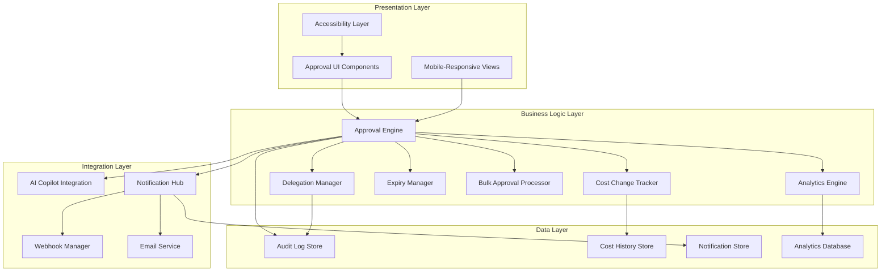
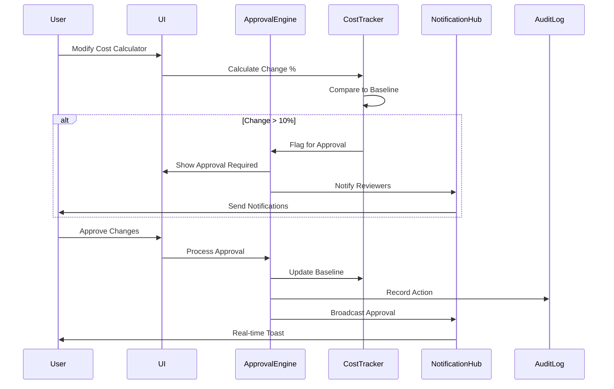

# Design Document: Advanced Approval Flows

## Overview

This design document specifies the implementation of advanced approval flow features (Phases 2-8) for the AI Model Recommendation Dashboard. The design builds upon the existing Phase 1 approval infrastructure and adds sophisticated capabilities including cost tracking with approval triggers, real-time collaboration integration, advanced approval operations (delegation, expiry, conditional, bulk), comprehensive analytics and audit logging, AI-powered suggestions, external integrations (Slack/Teams), and full mobile/accessibility support.

The implementation follows a modular architecture where each phase adds discrete capabilities that integrate with existing components while maintaining backward compatibility with Phase 1 features.

## Architecture

### High-Level Architecture



### Component Interaction Flow



## Components and Interfaces

### Phase 2: Cost Calculator Tracking Components

#### CostChangeTracker

Monitors and tracks cost estimate changes against baseline values.

```typescript
interface CostChangeTracker {
  // Store baseline cost when recommendation is created
  setBaseline(recommendationId: string, costEstimate: CostEstimate): void;
  
  // Calculate percentage change from baseline
  calculateChange(recommendationId: string, newCostEstimate: CostEstimate): CostChange;
  
  // Check if change exceeds threshold
  requiresApproval(change: CostChange): boolean;
  
  // Get cost history for a recommendation
  getHistory(recommendationId: string): CostHistoryEntry[];
  
  // Update baseline after approval
  updateBaseline(recommendationId: string, approvedCost: CostEstimate): void;
}

interface CostEstimate {
  infrastructure: number;
  compute: number;
  storage: number;
  networking: number;
  total: number;
}

interface CostChange {
  recommendationId: string;
  baseline: CostEstimate;
  current: CostEstimate;
  percentageChange: number;
  changedBy: string;
  timestamp: Date;
  requiresApproval: boolean;
}

interface CostHistoryEntry {
  timestamp: Date;
  user: string;
  previousCost: CostEstimate;
  newCost: CostEstimate;
  percentageChange: number;
  approved: boolean;
  approvedBy?: string;
  approvalTimestamp?: Date;
}
```

#### CostCalculatorLockManager

Manages locking and unlocking of cost calculators after final approval.

```typescript
interface CostCalculatorLockManager {
  // Lock calculator after final approval
  lock(recommendationId: string, lockedBy: string): void;
  
  // Unlock calculator (Admin only)
  unlock(recommendationId: string, unlockedBy: string, reason: string): void;
  
  // Check if calculator is locked
  isLocked(recommendationId: string): boolean;
  
  // Get lock status with details
  getLockStatus(recommendationId: string): LockStatus;
}

interface LockStatus {
  isLocked: boolean;
  lockedAt?: Date;
  lockedBy?: string;
  unlockedAt?: Date;
  unlockedBy?: string;
  unlockReason?: string;
}
```

### Phase 3: Collaboration Integration Components

#### RealTimeNotificationService

Handles real-time toast notifications for approval events.

```typescript
interface RealTimeNotificationService {
  // Broadcast approval event to connected users
  broadcastApprovalEvent(event: ApprovalEvent): void;
  
  // Show toast notification
  showToast(notification: ToastNotification): void;
  
  // Queue notifications to prevent overwhelming
  queueNotification(notification: ToastNotification): void;
  
  // Subscribe to approval events for a recommendation
  subscribe(recommendationId: string, callback: (event: ApprovalEvent) => void): Unsubscribe;
}

interface ApprovalEvent {
  type: 'submitted' | 'approved' | 'rejected' | 'delegated' | 'expired' | 'cost_change';
  recommendationId: string;
  actor: UserInfo;
  timestamp: Date;
  metadata: Record<string, any>;
}

interface ToastNotification {
  id: string;
  type: 'success' | 'info' | 'warning' | 'error';
  title: string;
  message: string;
  duration: number;
  dismissible: boolean;
}

type Unsubscribe = () => void;
```

#### CollaborationBarIntegration

Extends the existing collaboration bar to show approval activity.

```typescript
interface CollaborationBarIntegration {
  // Update user status in collaboration bar
  updateUserStatus(userId: string, status: UserApprovalStatus): void;
  
  // Get current approval activity for display
  getApprovalActivity(recommendationId: string): ApprovalActivity[];
  
  // Highlight users with pending approvals
  highlightPendingApprovers(recommendationId: string): string[];
}

interface UserApprovalStatus {
  userId: string;
  status: 'viewing' | 'reviewing' | 'approved' | 'rejected' | 'delegated';
  timestamp: Date;
  badge?: ApprovalBadge;
}

interface ApprovalActivity {
  user: UserInfo;
  action: string;
  timestamp: Date;
  status: UserApprovalStatus;
}

interface ApprovalBadge {
  type: 'pending' | 'approved' | 'rejected' | 'delegated';
  color: string;
  icon: string;
}
```

#### CommentThreadManager

Manages threaded comments on approval decisions.

```typescript
interface CommentThreadManager {
  // Add comment to approval
  addComment(approvalId: string, comment: Comment): string;
  
  // Add reply to comment
  addReply(commentId: string, reply: Comment): string;
  
  // Get comment thread
  getThread(approvalId: string): CommentThread;
  
  // Edit comment (within 5 minutes)
  editComment(commentId: string, newContent: string): boolean;
  
  // Delete comment (within 5 minutes)
  deleteComment(commentId: string): boolean;
  
  // Notify users of replies
  notifyReply(commentId: string, replyId: string): void;
}

interface Comment {
  id: string;
  authorId: string;
  content: string;
  timestamp: Date;
  edited: boolean;
  editedAt?: Date;
  replies: Comment[];
}

interface CommentThread {
  approvalId: string;
  comments: Comment[];
  totalCount: number;
}
```

### Phase 4: Advanced Approval Features

#### ApprovalDelegationManager

Handles delegation of approval responsibilities.

```typescript
interface ApprovalDelegationManager {
  // Delegate approval to another user
  delegate(
    approvalId: string,
    delegatorId: string,
    delegateId: string,
    reason: string
  ): DelegationResult;
  
  // Get active delegations for a user
  getActiveDelegations(userId: string): Delegation[];
  
  // Revoke delegation
  revokeDelegation(delegationId: string, reason: string): void;
  
  // Check if user can delegate
  canDelegate(userId: string, approvalId: string): boolean;
}

interface Delegation {
  id: string;
  approvalId: string;
  delegator: UserInfo;
  delegate: UserInfo;
  reason: string;
  createdAt: Date;
  revokedAt?: Date;
  revokeReason?: string;
  status: 'active' | 'completed' | 'revoked';
}

interface DelegationResult {
  success: boolean;
  delegationId?: string;
  error?: string;
}
```

#### ApprovalExpiryManager

Manages approval expiry deadlines and auto-escalation.

```typescript
interface ApprovalExpiryManager {
  // Set expiry deadline for approval
  setExpiry(approvalId: string, deadline: Date): void;
  
  // Get time remaining until expiry
  getTimeRemaining(approvalId: string): Duration;
  
  // Check for expiring approvals and send escalations
  checkExpiringApprovals(): void;
  
  // Escalate expired approval
  escalate(approvalId: string): void;
  
  // Extend expiry deadline (Admin only)
  extendDeadline(approvalId: string, newDeadline: Date, reason: string): void;
}

interface Duration {
  hours: number;
  minutes: number;
  seconds: number;
  isExpired: boolean;
  isNearExpiry: boolean; // < 6 hours
}
```

#### ConditionalApprovalManager

Handles approvals with specific conditions attached.

```typescript
interface ConditionalApprovalManager {
  // Create conditional approval
  createConditionalApproval(
    approvalId: string,
    conditions: ApprovalCondition[]
  ): string;
  
  // Get conditions for approval
  getConditions(approvalId: string): ApprovalCondition[];
  
  // Mark condition as met
  markConditionMet(conditionId: string, metBy: string, evidence: string): void;
  
  // Waive condition (Admin only)
  waiveCondition(conditionId: string, waivedBy: string, reason: string): void;
  
  // Check if all conditions are resolved
  areConditionsResolved(approvalId: string): boolean;
}

interface ApprovalCondition {
  id: string;
  description: string;
  createdBy: string;
  createdAt: Date;
  status: 'pending' | 'met' | 'waived';
  metBy?: string;
  metAt?: Date;
  evidence?: string;
  waivedBy?: string;
  waivedAt?: Date;
  waiveReason?: string;
}
```

#### BulkApprovalProcessor

Processes multiple approvals simultaneously.

```typescript
interface BulkApprovalProcessor {
  // Validate recommendations for bulk approval
  validateBulkApproval(recommendationIds: string[]): ValidationResult;
  
  // Process bulk approval
  processBulkApproval(
    recommendationIds: string[],
    approverId: string,
    comment: string
  ): BulkApprovalResult;
  
  // Check if recommendations are similar enough for bulk approval
  areSimilar(recommendationIds: string[]): boolean;
}

interface ValidationResult {
  valid: boolean;
  errors: string[];
  warnings: string[];
  eligibleIds: string[];
  ineligibleIds: string[];
}

interface BulkApprovalResult {
  totalProcessed: number;
  successful: string[];
  failed: BulkApprovalFailure[];
  comment: string;
}

interface BulkApprovalFailure {
  recommendationId: string;
  reason: string;
  error: string;
}
```

### Phase 5: Analytics and History Components

#### ApprovalTimelineBuilder

Creates visual timeline representations of approval history.

```typescript
interface ApprovalTimelineBuilder {
  // Build timeline for a recommendation
  buildTimeline(recommendationId: string): ApprovalTimeline;
  
  // Filter timeline by criteria
  filterTimeline(
    timeline: ApprovalTimeline,
    filters: TimelineFilters
  ): ApprovalTimeline;
  
  // Calculate stage durations
  calculateStageDurations(timeline: ApprovalTimeline): StageDuration[];
}

interface ApprovalTimeline {
  recommendationId: string;
  events: TimelineEvent[];
  totalDuration: Duration;
  currentStage: string;
}

interface TimelineEvent {
  id: string;
  type: 'submitted' | 'approved' | 'rejected' | 'delegated' | 'cost_change' | 'comment' | 'escalated';
  timestamp: Date;
  actor: UserInfo;
  details: Record<string, any>;
  icon: string;
  color: string;
}

interface TimelineFilters {
  actionTypes?: string[];
  userIds?: string[];
  dateRange?: { start: Date; end: Date };
}

interface StageDuration {
  stage: string;
  startTime: Date;
  endTime?: Date;
  duration: Duration;
}
```

#### ApprovalAnalyticsEngine

Generates analytics and insights from approval data.

```typescript
interface ApprovalAnalyticsEngine {
  // Calculate average approval time metrics
  calculateAverageApprovalTime(filters: AnalyticsFilters): ApprovalTimeMetrics;
  
  // Calculate approval rates
  calculateApprovalRates(filters: AnalyticsFilters): ApprovalRateMetrics;
  
  // Identify bottlenecks
  identifyBottlenecks(filters: AnalyticsFilters): Bottleneck[];
  
  // Generate trend data
  generateTrends(filters: AnalyticsFilters): TrendData;
}

interface AnalyticsFilters {
  dateRange: { start: Date; end: Date };
  userRoles?: string[];
  recommendationTypes?: string[];
  approvers?: string[];
}

interface ApprovalTimeMetrics {
  averageTimeByStage: Map<string, Duration>;
  averageTimeByApprover: Map<string, Duration>;
  overallAverage: Duration;
  median: Duration;
  percentile95: Duration;
}

interface ApprovalRateMetrics {
  approvalRateByUser: Map<string, number>;
  approvalRateByType: Map<string, number>;
  overallApprovalRate: number;
  rejectionReasons: Map<string, number>;
}

interface Bottleneck {
  stage: string;
  approver?: string;
  averageDelay: Duration;
  affectedRecommendations: number;
  severity: 'low' | 'medium' | 'high';
}

interface TrendData {
  approvalVolume: TimeSeriesData[];
  averageTime: TimeSeriesData[];
  approvalRate: TimeSeriesData[];
}

interface TimeSeriesData {
  timestamp: Date;
  value: number;
}
```

#### AuditLogManager

Manages immutable audit log for compliance.

```typescript
interface AuditLogManager {
  // Record audit event
  recordEvent(event: AuditEvent): void;
  
  // Search audit log
  searchLog(criteria: AuditSearchCriteria): AuditLogEntry[];
  
  // Export audit log
  exportLog(format: 'csv' | 'json', filters: AuditSearchCriteria): string;
  
  // Get audit trail for specific recommendation
  getAuditTrail(recommendationId: string): AuditLogEntry[];
}

interface AuditEvent {
  eventType: string;
  userId: string;
  recommendationId?: string;
  timestamp: Date;
  metadata: Record<string, any>;
  ipAddress?: string;
  userAgent?: string;
}

interface AuditLogEntry {
  id: string;
  event: AuditEvent;
  immutable: true;
  hash: string; // For integrity verification
}

interface AuditSearchCriteria {
  eventTypes?: string[];
  userIds?: string[];
  recommendationIds?: string[];
  dateRange?: { start: Date; end: Date };
  limit?: number;
  offset?: number;
}
```

### Phase 6: Integration Components

#### AICopilotApprovalAdvisor

Integrates with AI Copilot to provide approval suggestions.

```typescript
interface AICopilotApprovalAdvisor {
  // Analyze recommendation and suggest action
  suggestApprovalAction(recommendationId: string): ApprovalSuggestion;
  
  // Identify potential issues
  identifyIssues(recommendationId: string): Issue[];
  
  // Analyze cost changes
  analyzeCostChange(change: CostChange): CostAnalysis;
  
  // Provide reasoning for suggestion
  explainSuggestion(suggestionId: string): Explanation;
}

interface ApprovalSuggestion {
  id: string;
  recommendedAction: 'approve' | 'reject' | 'request_changes';
  confidence: number; // 0-1
  reasoning: string[];
  issues: Issue[];
  dataPoints: DataPoint[];
}

interface Issue {
  severity: 'low' | 'medium' | 'high' | 'critical';
  category: string;
  description: string;
  recommendation: string;
  affectedArea: string;
}

interface CostAnalysis {
  isReasonable: boolean;
  reasoning: string;
  comparisonToSimilar: number; // percentage difference
  riskLevel: 'low' | 'medium' | 'high';
  suggestions: string[];
}

interface DataPoint {
  label: string;
  value: any;
  source: string;
}

interface Explanation {
  suggestionId: string;
  detailedReasoning: string;
  supportingData: DataPoint[];
  alternatives: string[];
}
```

#### PipelineApprovalManager

Manages approval checkpoints in the recommendation pipeline.

```typescript
interface PipelineApprovalManager {
  // Define pipeline checkpoints
  defineCheckpoints(recommendationType: string, checkpoints: Checkpoint[]): void;
  
  // Get checkpoints for recommendation
  getCheckpoints(recommendationId: string): Checkpoint[];
  
  // Check if recommendation can proceed to next stage
  canProceed(recommendationId: string, currentStage: string): boolean;
  
  // Process checkpoint approval
  processCheckpoint(
    recommendationId: string,
    checkpointId: string,
    approved: boolean
  ): CheckpointResult;
  
  // Return to previous stage
  returnToPreviousStage(recommendationId: string, reason: string): void;
}

interface Checkpoint {
  id: string;
  stage: string;
  name: string;
  description: string;
  required: boolean;
  approverRole: string;
  order: number;
}

interface CheckpointResult {
  success: boolean;
  nextStage?: string;
  previousStage?: string;
  message: string;
}
```

#### APIIntegrationApprovalManager

Handles separate approval workflow for API specifications.

```typescript
interface APIIntegrationApprovalManager {
  // Submit API specs for approval
  submitAPISpecs(recommendationId: string, specs: APISpecification): string;
  
  // Approve or reject API specs
  reviewAPISpecs(
    specId: string,
    approved: boolean,
    reviewerId: string,
    comments: string
  ): void;
  
  // Check if API specs are approved
  areAPISpecsApproved(recommendationId: string): boolean;
  
  // Get API spec approval status
  getAPISpecStatus(recommendationId: string): APISpecApprovalStatus;
  
  // Trigger re-approval when specs change
  handleSpecChange(specId: string): void;
}

interface APISpecification {
  endpoints: APIEndpoint[];
  authentication: AuthenticationSpec;
  rateLimit: RateLimitSpec;
  dataFormats: string[];
  version: string;
}

interface APIEndpoint {
  path: string;
  method: string;
  description: string;
  requestSchema: object;
  responseSchema: object;
}

interface APISpecApprovalStatus {
  specId: string;
  approved: boolean;
  reviewedBy?: string;
  reviewedAt?: Date;
  comments?: string;
  requiresReapproval: boolean;
}
```

### Phase 7: Notification System Components

#### NotificationCenter

Central hub for managing all notifications.

```typescript
interface NotificationCenter {
  // Get notifications for user
  getNotifications(userId: string, filters?: NotificationFilters): Notification[];
  
  // Get unread count
  getUnreadCount(userId: string): number;
  
  // Mark notification as read
  markAsRead(notificationId: string): void;
  
  // Mark all as read
  markAllAsRead(userId: string): void;
  
  // Delete notification
  deleteNotification(notificationId: string): void;
  
  // Subscribe to new notifications
  subscribeToNotifications(userId: string, callback: (notification: Notification) => void): Unsubscribe;
}

interface Notification {
  id: string;
  userId: string;
  type: 'approval_required' | 'approved' | 'rejected' | 'delegated' | 'expired' | 'comment' | 'escalated';
  title: string;
  message: string;
  timestamp: Date;
  read: boolean;
  actionUrl?: string;
  metadata: Record<string, any>;
}

interface NotificationFilters {
  types?: string[];
  read?: boolean;
  dateRange?: { start: Date; end: Date };
}
```

#### EmailNotificationService

Sends email notifications for approval events.

```typescript
interface EmailNotificationService {
  // Send email notification
  sendEmail(recipient: string, email: EmailNotification): Promise<void>;
  
  // Send batch digest email
  sendDigest(recipient: string, notifications: Notification[]): Promise<void>;
  
  // Get user email preferences
  getPreferences(userId: string): EmailPreferences;
  
  // Update user email preferences
  updatePreferences(userId: string, preferences: EmailPreferences): void;
}

interface EmailNotification {
  subject: string;
  body: string;
  actionUrl?: string;
  priority: 'low' | 'normal' | 'high';
}

interface EmailPreferences {
  enabled: boolean;
  eventTypes: string[];
  digestEnabled: boolean;
  digestFrequency: 'immediate' | 'hourly' | 'daily';
}
```

#### WebhookIntegrationService

Manages webhook integrations for Slack and Teams.

```typescript
interface WebhookIntegrationService {
  // Configure webhook
  configureWebhook(config: WebhookConfig): string;
  
  // Send webhook notification
  sendWebhook(webhookId: string, event: ApprovalEvent): Promise<WebhookResponse>;
  
  // Handle interactive webhook response
  handleWebhookAction(action: WebhookAction): void;
  
  // Test webhook connection
  testWebhook(webhookId: string): Promise<boolean>;
  
  // Get configured webhooks
  getWebhooks(): WebhookConfig[];
}

interface WebhookConfig {
  id: string;
  name: string;
  platform: 'slack' | 'teams';
  url: string;
  eventTypes: string[];
  enabled: boolean;
  includeInteractiveButtons: boolean;
}

interface WebhookResponse {
  success: boolean;
  statusCode: number;
  error?: string;
}

interface WebhookAction {
  webhookId: string;
  userId: string;
  action: 'approve' | 'reject' | 'view';
  recommendationId: string;
  timestamp: Date;
}
```

### Phase 8: Mobile and Accessibility Components

#### MobileApprovalInterface

Provides mobile-optimized approval interface.

```typescript
interface MobileApprovalInterface {
  // Render mobile-optimized approval view
  renderMobileView(recommendationId: string): MobileApprovalView;
  
  // Handle swipe gestures
  handleSwipeGesture(gesture: SwipeGesture): void;
  
  // Optimize for one-handed use
  getOneHandedLayout(): LayoutConfig;
  
  // Check if device is mobile
  isMobileDevice(): boolean;
}

interface MobileApprovalView {
  summary: ApprovalSummary;
  expandableDetails: ExpandableSection[];
  quickActions: QuickAction[];
  swipeEnabled: boolean;
}

interface SwipeGesture {
  direction: 'left' | 'right';
  recommendationId: string;
  userId: string;
}

interface QuickAction {
  label: string;
  action: string;
  icon: string;
  touchTargetSize: { width: number; height: number };
}
```

#### AccessibilityManager

Ensures full accessibility compliance.

```typescript
interface AccessibilityManager {
  // Announce status change to screen readers
  announceStatusChange(message: string, priority: 'polite' | 'assertive'): void;
  
  // Validate keyboard navigation
  validateKeyboardNav(component: React.Component): ValidationResult;
  
  // Check contrast ratios
  checkContrast(foreground: string, background: string): ContrastResult;
  
  // Generate ARIA labels
  generateAriaLabel(element: UIElement): string;
  
  // Ensure focus indicators
  ensureFocusIndicators(component: React.Component): void;
}

interface ContrastResult {
  ratio: number;
  meetsAA: boolean;
  meetsAAA: boolean;
  recommendation?: string;
}

interface UIElement {
  type: string;
  label: string;
  role: string;
  state?: Record<string, any>;
}
```

## Data Models

### Extended Recommendation Model

```typescript
interface Recommendation {
  // Existing Phase 1 fields
  id: string;
  title: string;
  description: string;
  status: ApprovalStatus;
  submittedBy: string;
  submittedAt: Date;
  
  // Phase 2: Cost tracking
  costBaseline: CostEstimate;
  currentCost: CostEstimate;
  costHistory: CostHistoryEntry[];
  costLocked: boolean;
  costLockStatus?: LockStatus;
  
  // Phase 3: Collaboration
  commentThreads: CommentThread[];
  collaborationActivity: ApprovalActivity[];
  
  // Phase 4: Advanced approvals
  delegations: Delegation[];
  expiryDeadline?: Date;
  conditionalApproval?: {
    conditions: ApprovalCondition[];
    allResolved: boolean;
  };
  
  // Phase 6: Pipeline and API
  pipelineCheckpoints: CheckpointStatus[];
  apiSpecification?: APISpecification;
  apiSpecApprovalStatus?: APISpecApprovalStatus;
}

interface CheckpointStatus {
  checkpoint: Checkpoint;
  status: 'pending' | 'approved' | 'rejected';
  reviewedBy?: string;
  reviewedAt?: Date;
}
```

### Notification Model

```typescript
interface NotificationModel {
  id: string;
  userId: string;
  type: NotificationType;
  title: string;
  message: string;
  timestamp: Date;
  read: boolean;
  deleted: boolean;
  actionUrl?: string;
  relatedRecommendationId?: string;
  relatedUserId?: string;
  metadata: Record<string, any>;
  expiresAt?: Date;
}

type NotificationType =
  | 'approval_required'
  | 'approved'
  | 'rejected'
  | 'delegated'
  | 'expired'
  | 'escalated'
  | 'comment_reply'
  | 'cost_change'
  | 'condition_met'
  | 'bulk_approval';
```

### Analytics Model

```typescript
interface AnalyticsSnapshot {
  id: string;
  timestamp: Date;
  period: 'hourly' | 'daily' | 'weekly' | 'monthly';
  metrics: {
    totalApprovals: number;
    totalRejections: number;
    averageApprovalTime: Duration;
    approvalRate: number;
    activeRecommendations: number;
    expiredApprovals: number;
    delegatedApprovals: number;
    conditionalApprovals: number;
    bulkApprovals: number;
  };
  byUser: Map<string, UserMetrics>;
  byType: Map<string, TypeMetrics>;
  bottlenecks: Bottleneck[];
}

interface UserMetrics {
  userId: string;
  approvalsProcessed: number;
  averageTime: Duration;
  approvalRate: number;
  delegationsReceived: number;
  delegationsGiven: number;
}

interface TypeMetrics {
  type: string;
  count: number;
  averageTime: Duration;
  approvalRate: number;
}
```


## Correctness Properties

*A property is a characteristic or behavior that should hold true across all valid executions of a system—essentially, a formal statement about what the system should do. Properties serve as the bridge between human-readable specifications and machine-verifiable correctness guarantees.*

### Property Reflection

After analyzing all 105 acceptance criteria, several opportunities for consolidation emerged:

- **Cost tracking properties (1.1-1.5)**: Can be consolidated into properties about baseline storage, change calculation, and history maintenance
- **Permission properties (2.2, 2.5, 3.2)**: Multiple role-based access control checks can be combined into comprehensive permission properties
- **Audit logging properties (2.4, 3.3, 7.4, 13.1-13.2)**: All audit logging requirements can be consolidated into properties about log completeness and immutability
- **Notification properties (4.1-4.2, 6.3, 7.3)**: Multiple notification triggering requirements can be combined into properties about notification delivery and content
- **UI rendering properties (1.4, 3.4, 5.3, 9.2)**: Similar visual indicator requirements can be consolidated
- **Workflow enforcement properties (9.3, 9.5, 15.2, 16.5)**: Multiple blocking conditions can be combined into comprehensive workflow properties

The following properties represent the unique, non-redundant validation requirements:

### Phase 2: Cost Calculator Properties

**Property 1: Baseline Cost Storage**
*For any* recommendation that is created, the system should store the initial cost estimate as a baseline that can be retrieved later.
**Validates: Requirements 1.1**

**Property 2: Cost Change Calculation Accuracy**
*For any* baseline cost and modified cost, the calculated percentage change should equal `((modified - baseline) / baseline) * 100`.
**Validates: Requirements 1.2**

**Property 3: Approval Flagging Threshold**
*For any* cost change, if the percentage change exceeds 10% (positive or negative), the recommendation should be flagged as requiring approval.
**Validates: Requirements 1.3**

**Property 4: Cost History Completeness**
*For any* sequence of cost modifications, all modifications should appear in the cost history in chronological order with complete metadata (timestamp, user, previous cost, new cost, percentage change).
**Validates: Requirements 1.5**

**Property 5: Baseline Update After Approval**
*For any* cost change approval by a Solution Architect, the baseline cost should be updated to match the approved cost.
**Validates: Requirements 2.3**

**Property 6: Role-Based Calculator Access Control**
*For any* user and cost calculator state, editing should be allowed if and only if: (user is Solution Architect) OR (calculator is unlocked AND user is Admin).
**Validates: Requirements 2.2, 2.5, 3.2**

**Property 7: Automatic Locking on Final Approval**
*For any* recommendation that receives final approval, the cost calculator should transition to locked state immediately.
**Validates: Requirements 3.1**

**Property 8: Audit Log Completeness**
*For any* approval-related action (approval, rejection, delegation, unlock, cost change), an immutable audit log entry should be created containing timestamp, user identity, action type, affected recommendation, and complete metadata.
**Validates: Requirements 2.4, 3.3, 7.4, 13.1, 13.2**

### Phase 3: Collaboration Properties

**Property 9: Real-Time Notification Delivery**
*For any* approval event and any user currently viewing the affected recommendation, a toast notification should be delivered to that user containing approver name, action type, and timestamp.
**Validates: Requirements 4.1, 4.2**

**Property 10: Notification Queue Rate Limiting**
*For any* sequence of rapid approval events (more than 3 events within 10 seconds), notifications should be queued such that no more than 3 notifications are displayed simultaneously.
**Validates: Requirements 4.3**

**Property 11: Collaboration Status Synchronization**
*For any* user action (reviewing, approving, rejecting), the collaboration bar should update that user's status within 1 second to reflect the current action.
**Validates: Requirements 5.1, 5.2**

**Property 12: Comment Thread Structure**
*For any* comment thread, replies should be properly nested under their parent comments, and all comments should be ordered chronologically by timestamp.
**Validates: Requirements 6.2, 6.4**

**Property 13: Reply Notification Triggering**
*For any* reply added to a comment, a notification should be sent to the original comment author.
**Validates: Requirements 6.3**

### Phase 4: Advanced Approval Properties

**Property 14: Delegation Authorization**
*For any* user with approval authority on a recommendation, that user should be able to delegate their approval responsibility to another user with appropriate role.
**Validates: Requirements 7.1**

**Property 15: Delegation Input Validation**
*For any* delegation attempt, the operation should fail if either the delegate user is not specified or the reason is empty.
**Validates: Requirements 7.2**

**Property 16: Delegation Notification**
*For any* successful delegation, a notification should be sent immediately to the delegate user.
**Validates: Requirements 7.3**

**Property 17: Delegated Action Attribution**
*For any* approval or rejection performed by a delegate, the action should be attributed to both the delegate (as actor) and the original approver (as delegator) in all records.
**Validates: Requirements 7.5**

**Property 18: Default Expiry Deadline**
*For any* recommendation submitted for approval, the expiry deadline should be set to exactly 48 hours from the submission timestamp.
**Validates: Requirements 8.1**

**Property 19: Expiry Escalation**
*For any* approval that expires without action, the system should automatically escalate to the next approval level.
**Validates: Requirements 8.4**

**Property 20: Conditional Approval Workflow Enforcement**
*For any* recommendation with conditional approval, final approval should be blocked until all conditions are either marked as met or waived.
**Validates: Requirements 9.3, 9.5**

**Property 21: Condition Status Tracking**
*For any* approval condition, the system should track its status (pending, met, waived) along with the user who changed the status and timestamp.
**Validates: Requirements 9.4**

**Property 22: Bulk Approval Similarity Validation**
*For any* set of recommendations selected for bulk approval, the operation should be rejected if the recommendations have different types or cost ranges that differ by more than 20%.
**Validates: Requirements 10.5**

**Property 23: Bulk Approval Individual Processing**
*For any* bulk approval operation, each recommendation should be processed independently, and failures in processing one recommendation should not prevent processing of others.
**Validates: Requirements 10.4**

**Property 24: Bulk Approval Comment Propagation**
*For any* bulk approval with a comment, the same comment should appear on all successfully approved recommendations.
**Validates: Requirements 10.3**

### Phase 5: Analytics and History Properties

**Property 25: Timeline Chronological Ordering**
*For any* approval timeline, all events should be ordered by timestamp in ascending chronological order.
**Validates: Requirements 11.1**

**Property 26: Timeline Event Differentiation**
*For any* timeline event, it should have a unique icon and color based on its action type (submitted, approved, rejected, delegated, etc.).
**Validates: Requirements 11.2**

**Property 27: Stage Duration Calculation**
*For any* two consecutive approval stages, the duration between them should equal the difference between their timestamps.
**Validates: Requirements 11.4**

**Property 28: Timeline Filtering**
*For any* timeline and filter criteria (action type, user, date range), the filtered timeline should contain only events matching all specified criteria.
**Validates: Requirements 11.5**

**Property 29: Average Approval Time Calculation**
*For any* set of completed approvals, the average approval time should equal the sum of all approval durations divided by the count of approvals.
**Validates: Requirements 12.1**

**Property 30: Approval Rate Calculation**
*For any* set of approvals, the approval rate should equal (count of approved) / (count of approved + count of rejected).
**Validates: Requirements 12.2**

**Property 31: Bottleneck Detection**
*For any* approval stage where the average duration exceeds 2x the overall average duration, that stage should be identified as a bottleneck.
**Validates: Requirements 12.3**

**Property 32: Analytics Filtering**
*For any* analytics query with filters (date range, user role, recommendation type), the calculated metrics should include only data matching all specified filters.
**Validates: Requirements 12.5**

**Property 33: Audit Log Searchability**
*For any* audit log search with criteria (event types, user IDs, recommendation IDs, date range), the results should contain only entries matching all specified criteria.
**Validates: Requirements 13.3**

**Property 34: Audit Log Export Round-Trip**
*For any* audit log data exported to CSV or JSON format, parsing the exported data should produce entries equivalent to the original data.
**Validates: Requirements 13.4**

### Phase 6: Integration Properties

**Property 35: AI Copilot Suggestion Generation**
*For any* recommendation pending approval, the AI Copilot should generate a suggestion containing a recommended action, confidence score, reasoning, and identified issues.
**Validates: Requirements 14.1, 14.2, 14.3**

**Property 36: AI Copilot Cost Analysis**
*For any* cost change detected in a recommendation, the AI Copilot should provide an analysis indicating whether the change is reasonable, with supporting reasoning.
**Validates: Requirements 14.4**

**Property 37: Pipeline Checkpoint Enforcement**
*For any* recommendation at a pipeline checkpoint, progression to the next stage should be blocked until the checkpoint receives approval.
**Validates: Requirements 15.2**

**Property 38: Checkpoint Rejection Rollback**
*For any* checkpoint that is rejected, the recommendation should return to the immediately previous stage.
**Validates: Requirements 15.5**

**Property 39: API Specification Approval Independence**
*For any* recommendation with API specifications, the API approval status should be independent of the main recommendation approval status (one can be approved while the other is pending).
**Validates: Requirements 16.3**

**Property 40: API Specification Change Detection**
*For any* API specification that is modified after approval, the approval status should reset to pending, requiring re-approval.
**Validates: Requirements 16.4**

**Property 41: Final Approval API Dependency**
*For any* recommendation with API specifications, final approval should be blocked if the API specifications are not approved.
**Validates: Requirements 16.5**

### Phase 7: Notification System Properties

**Property 42: Notification Unread Count Accuracy**
*For any* user, the unread notification count should equal the number of notifications where read=false.
**Validates: Requirements 17.2**

**Property 43: Notification Categorization**
*For any* set of notifications, grouping by type should result in categories where all notifications in each category have the same type value.
**Validates: Requirements 17.4**

**Property 44: Notification State Management**
*For any* notification, marking it as read or deleting it should update its state, and the change should be reflected in subsequent queries.
**Validates: Requirements 17.5**

**Property 45: Email Notification Triggering**
*For any* approval action requiring user attention, an email notification should be sent to the affected user unless email notifications are disabled in their preferences.
**Validates: Requirements 18.1, 18.5**

**Property 46: Email Preference Enforcement**
*For any* user with email preferences configured, only events matching their enabled event types should trigger email notifications.
**Validates: Requirements 18.2**

**Property 47: Email Content Completeness**
*For any* email notification, it should contain a subject, body, and a direct link to the relevant recommendation.
**Validates: Requirements 18.3**

**Property 48: Webhook Message Delivery**
*For any* approval event and any configured webhook matching the event type, a formatted message should be sent to the webhook URL.
**Validates: Requirements 19.2**

**Property 49: Webhook Interactive Button Inclusion**
*For any* webhook message sent to Slack or Teams with interactive buttons enabled, the message should contain action buttons for approve and reject.
**Validates: Requirements 19.3**

**Property 50: Webhook Action Bidirectional Sync**
*For any* approval action performed through a webhook (Slack/Teams button click), the approval status should update in the system and be reflected in the UI.
**Validates: Requirements 19.5**

### Phase 8: Mobile and Accessibility Properties

**Property 51: Mobile Layout Adaptation**
*For any* viewport width less than 768 pixels, the approval interface should render in mobile layout mode with stacked elements.
**Validates: Requirements 20.1**

**Property 52: Swipe Gesture Mapping**
*For any* swipe gesture on a mobile device, swipe right should trigger approve action and swipe left should trigger reject action.
**Validates: Requirements 20.2**

**Property 53: Touch Target Size Compliance**
*For any* interactive element in the approval interface, its touch target size should be at least 44x44 pixels.
**Validates: Requirements 20.4**

**Property 54: Screen Reader Announcement**
*For any* approval status change, a screen reader announcement should be made with the new status and relevant details.
**Validates: Requirements 21.1**

**Property 55: Keyboard Navigation Completeness**
*For any* approval action available via mouse, the same action should be accessible via keyboard navigation alone.
**Validates: Requirements 21.2**

**Property 56: ARIA Attribute Presence**
*For any* approval interface element, it should have appropriate ARIA labels and roles defined.
**Validates: Requirements 21.3**

**Property 57: Color Contrast Compliance**
*For any* text or visual indicator in the approval interface, the contrast ratio between foreground and background should be at least 4.5:1.
**Validates: Requirements 21.4**

**Property 58: Focus Indicator Visibility**
*For any* interactive approval element that receives keyboard focus, a visible focus indicator should be displayed.
**Validates: Requirements 21.5**

## Error Handling

### Cost Calculator Errors

**Locked Calculator Modification Attempts**:
- When a non-Admin user attempts to modify a locked calculator, return error: "Cost calculator is locked. Contact an administrator to unlock."
- Log the attempted modification in audit log
- Display user-friendly message explaining lock status

**Invalid Cost Values**:
- When cost values are negative or non-numeric, reject the modification
- Return validation error with specific field that failed
- Preserve previous valid cost estimate

**Baseline Missing**:
- When calculating cost change but baseline is missing, log error and set baseline to current cost
- Flag for manual review by Solution Architect

### Approval Workflow Errors

**Delegation to Invalid User**:
- When delegating to a user without appropriate role, reject delegation
- Return error: "Cannot delegate to user without approval authority"
- Suggest valid delegation targets

**Expired Approval Actions**:
- When user attempts to approve an expired approval, reject the action
- Return error: "This approval has expired and been escalated"
- Redirect to current approval owner

**Conditional Approval Violations**:
- When attempting final approval with unresolved conditions, block the action
- Return error listing all unresolved conditions
- Provide option to waive conditions (Admin only)

**Bulk Approval Failures**:
- When bulk approval encounters errors, continue processing remaining items
- Collect all failures and return detailed error report
- Mark successful approvals as complete
- Allow retry of failed items

### Integration Errors

**Webhook Delivery Failures**:
- When webhook delivery fails (timeout, 4xx/5xx response), retry up to 3 times with exponential backoff
- After 3 failures, log error and notify Admin
- Queue message for manual retry

**Email Delivery Failures**:
- When email fails to send, retry up to 3 times
- After failures, log error and create in-app notification as fallback
- Do not block approval workflow on email failures

**AI Copilot Unavailable**:
- When AI Copilot service is unavailable, gracefully degrade
- Show approval interface without AI suggestions
- Display message: "AI suggestions temporarily unavailable"
- Log service outage for monitoring

### Data Consistency Errors

**Audit Log Write Failures**:
- When audit log write fails, retry immediately
- If retry fails, queue for background processing
- Block the approval action until audit log is written (critical for compliance)
- Alert Admin if audit log is unavailable for more than 5 minutes

**Timeline Synchronization Errors**:
- When timeline events are out of order, automatically re-sort by timestamp
- Log data inconsistency warning
- Trigger background job to verify data integrity

**Notification Delivery Failures**:
- When real-time notification fails to deliver, fall back to polling mechanism
- Store notification in database for retrieval
- Display notification on next page load or refresh

## Testing Strategy

### Dual Testing Approach

This feature requires both unit testing and property-based testing to ensure comprehensive coverage:

**Unit Tests**: Focus on specific examples, edge cases, and error conditions
- Specific cost change scenarios (exactly 10%, 9.9%, 10.1%)
- Edge cases (empty comments, missing users, invalid dates)
- Error conditions (locked calculator access, expired approvals)
- Integration points between components
- UI component rendering with specific props

**Property Tests**: Verify universal properties across all inputs
- Cost calculation accuracy across random cost values
- Permission checks across random user roles and states
- Audit log completeness across random action sequences
- Timeline ordering across random event sequences
- Notification delivery across random approval events

### Property-Based Testing Configuration

**Testing Library**: Use `fast-check` for TypeScript/JavaScript property-based testing

**Test Configuration**:
- Minimum 100 iterations per property test (due to randomization)
- Each property test must reference its design document property
- Tag format: `// Feature: approval-flows-advanced, Property {number}: {property_text}`

**Example Property Test Structure**:

```typescript
import fc from 'fast-check';

// Feature: approval-flows-advanced, Property 2: Cost Change Calculation Accuracy
test('cost change percentage calculation is accurate', () => {
  fc.assert(
    fc.property(
      fc.record({
        baseline: fc.float({ min: 1, max: 1000000 }),
        modified: fc.float({ min: 1, max: 1000000 })
      }),
      ({ baseline, modified }) => {
        const expectedChange = ((modified - baseline) / baseline) * 100;
        const actualChange = calculateCostChange(baseline, modified);
        expect(actualChange).toBeCloseTo(expectedChange, 2);
      }
    ),
    { numRuns: 100 }
  );
});

// Feature: approval-flows-advanced, Property 6: Role-Based Calculator Access Control
test('calculator editing follows role-based access control', () => {
  fc.assert(
    fc.property(
      fc.record({
        userRole: fc.constantFrom('Admin', 'Solution_Architect', 'Project_Manager', 'Viewer'),
        calculatorLocked: fc.boolean()
      }),
      ({ userRole, calculatorLocked }) => {
        const canEdit = canEditCalculator(userRole, calculatorLocked);
        const expected = 
          userRole === 'Solution_Architect' || 
          (!calculatorLocked && userRole === 'Admin');
        expect(canEdit).toBe(expected);
      }
    ),
    { numRuns: 100 }
  );
});
```

### Testing Phases

**Phase 2 Testing**:
- Property tests for cost calculation accuracy (Property 2)
- Property tests for approval flagging threshold (Property 3)
- Property tests for role-based access control (Property 6)
- Unit tests for lock/unlock operations
- Unit tests for cost history display

**Phase 3 Testing**:
- Property tests for notification delivery (Property 9)
- Property tests for comment thread structure (Property 12)
- Unit tests for collaboration bar UI updates
- Integration tests for real-time synchronization

**Phase 4 Testing**:
- Property tests for delegation authorization (Property 14)
- Property tests for conditional approval enforcement (Property 20)
- Property tests for bulk approval processing (Property 23)
- Unit tests for expiry countdown display
- Unit tests for delegation UI

**Phase 5 Testing**:
- Property tests for timeline ordering (Property 25)
- Property tests for analytics calculations (Properties 29, 30)
- Property tests for audit log export round-trip (Property 34)
- Unit tests for analytics dashboard rendering
- Unit tests for timeline filtering

**Phase 6 Testing**:
- Property tests for pipeline checkpoint enforcement (Property 37)
- Property tests for API approval independence (Property 39)
- Unit tests for AI Copilot suggestion display
- Integration tests for AI Copilot API calls
- Unit tests for checkpoint configuration

**Phase 7 Testing**:
- Property tests for notification count accuracy (Property 42)
- Property tests for email preference enforcement (Property 46)
- Property tests for webhook delivery (Property 48)
- Unit tests for notification center UI
- Integration tests for email service
- Integration tests for webhook endpoints

**Phase 8 Testing**:
- Property tests for touch target size compliance (Property 53)
- Property tests for keyboard navigation completeness (Property 55)
- Property tests for color contrast compliance (Property 57)
- Unit tests for mobile layout rendering
- Unit tests for swipe gesture handling
- Accessibility audit using axe-core

### Test Data Generation

**Generators for Property Tests**:

```typescript
// Cost estimate generator
const costEstimateGen = fc.record({
  infrastructure: fc.float({ min: 0, max: 100000 }),
  compute: fc.float({ min: 0, max: 100000 }),
  storage: fc.float({ min: 0, max: 50000 }),
  networking: fc.float({ min: 0, max: 20000 })
}).map(costs => ({
  ...costs,
  total: costs.infrastructure + costs.compute + costs.storage + costs.networking
}));

// User role generator
const userRoleGen = fc.constantFrom(
  'Admin',
  'Solution_Architect',
  'Project_Manager',
  'Viewer'
);

// Approval event generator
const approvalEventGen = fc.record({
  type: fc.constantFrom('submitted', 'approved', 'rejected', 'delegated', 'expired'),
  recommendationId: fc.uuid(),
  actor: fc.record({
    id: fc.uuid(),
    name: fc.string({ minLength: 3, maxLength: 50 }),
    role: userRoleGen
  }),
  timestamp: fc.date(),
  metadata: fc.dictionary(fc.string(), fc.anything())
});

// Comment thread generator
const commentGen = fc.record({
  id: fc.uuid(),
  authorId: fc.uuid(),
  content: fc.string({ minLength: 1, maxLength: 500 }),
  timestamp: fc.date(),
  edited: fc.boolean()
});

const commentThreadGen = fc.array(commentGen, { minLength: 1, maxLength: 20 });
```

### Integration Testing

**Real-Time Collaboration Testing**:
- Simulate multiple users viewing same recommendation
- Verify all users receive notifications
- Test notification queuing under high load
- Verify collaboration bar updates synchronize

**External Integration Testing**:
- Mock Slack/Teams webhook endpoints
- Verify webhook message format
- Test interactive button responses
- Verify email service integration

**End-to-End Approval Workflows**:
- Test complete approval flow from submission to final approval
- Test delegation workflow
- Test conditional approval workflow
- Test bulk approval workflow
- Test pipeline checkpoint workflow

### Performance Testing

**Scalability Tests**:
- Test with 1000+ recommendations
- Test bulk approval of 50+ recommendations
- Test analytics calculation with 10,000+ approval events
- Test audit log search with 100,000+ entries

**Real-Time Performance**:
- Verify notification delivery within 1 second
- Verify collaboration bar updates within 1 second
- Verify timeline rendering with 100+ events completes within 2 seconds

### Accessibility Testing

**Automated Accessibility Audits**:
- Run axe-core on all approval interface components
- Verify WCAG 2.1 Level AA compliance
- Test with screen reader simulators

**Manual Accessibility Testing**:
- Test complete keyboard navigation
- Test with actual screen readers (NVDA, JAWS, VoiceOver)
- Test with high contrast mode
- Test with 200% zoom level

